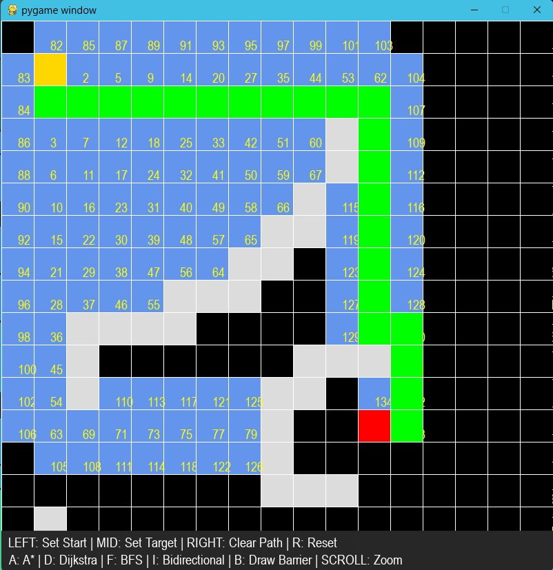
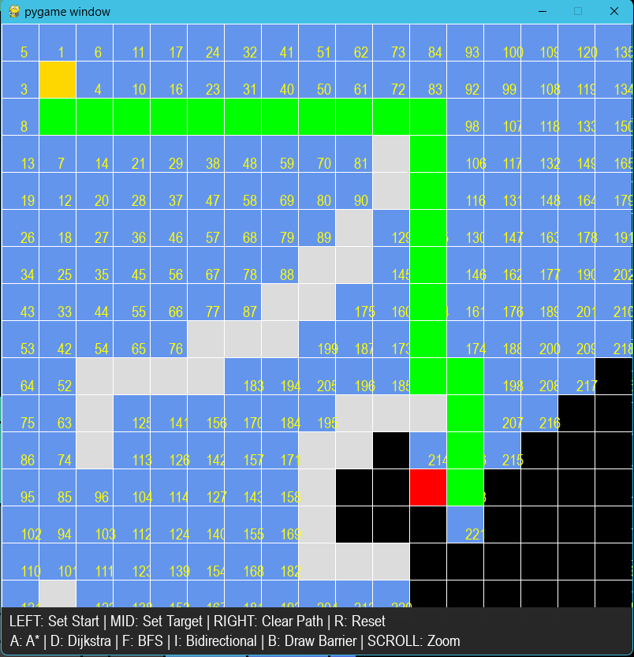
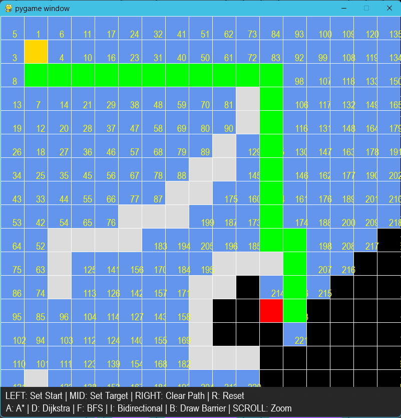
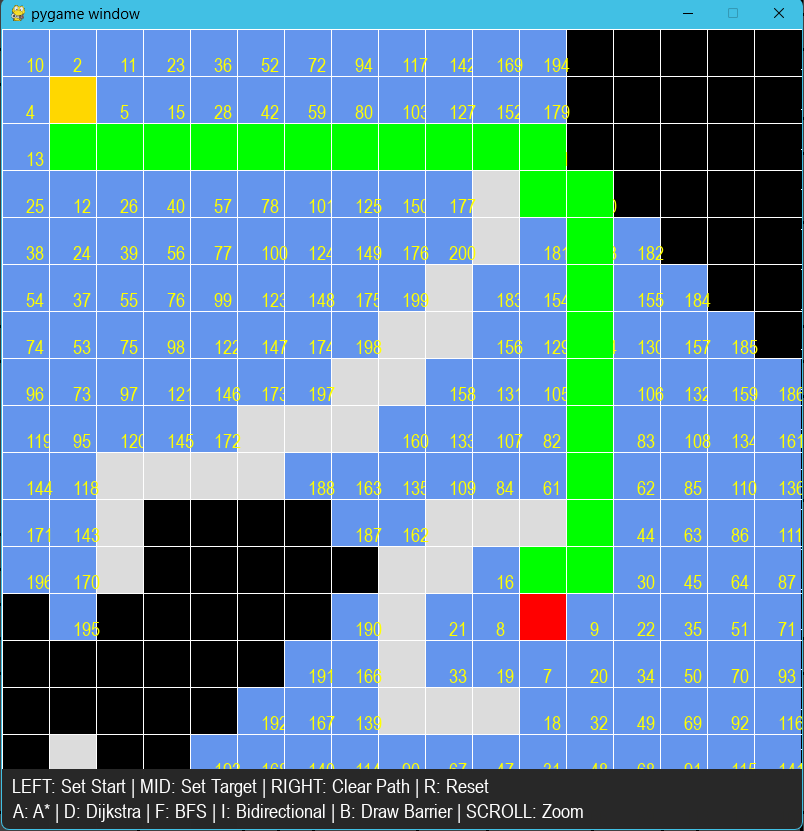

# Pathfinding Engine

This repository contains a modular pathfinding engine in Python designed for
education, benchmarking, and visualization.

Key features

- Cleanly separated modules: core, algorithms, ui, benchmarks
- A\*, Dijkstra, BFS, Bidirectional BFS
- Pluggable heuristics: Manhattan, Euclidean, Octile, Zero
- Weighted terrain and obstacles
- Runtime metrics: nodes expanded, path length, runtime ms, max open set
- Pygame renderer for interactive visualization
- Benchmark runner with CSV output

The implementation lives in this repository root (the project folder is
`path-finding-alogithms-visualizer`), with subpackages `core`,
`algorithms`, `ui` and `benchmarks`.

## Running

- Install dependencies (preferably inside a virtual environment):

  ```powershell
  python -m venv .venv
  . .venv\Scripts\Activate.ps1
  pip install -r requirements.txt
  ```

### Interactive UI (root)

Launch the legacy UI with zoom/barrier support (from the repository root):

```powershell
python main.py
```

Controls are shown on-screen but include:

- Left click – set start
- Middle click – set goal
- Right click – clear path (keep start/goal/barriers)
- Mouse wheel – zoom
- Hold **b** – paint barriers
- **r** – reset barriers/path
- **a**, **d**, **f**, **i** – run A\*, Dijkstra, BFS, Bidirectional

### Interactive UI (package)

The same functionality is exposed by imports from the `core`, `algorithms`,
`ui`, and `benchmarks` packages; you can run the module directly with Python
from the repository root:

```powershell
python -m main
```

or simply use `python main.py` as above. (There is no `pathfinding_engine`
package in this repo.)

### Benchmark mode

Run algorithms headless and export metrics:

```powershell
python -m benchmarks.runner --rows 100 --cols 100 --density 0.3 --runs 10
```

## Design notes

- Algorithms operate on simple `(row, col)` tuples for speed. The `Grid`
  class computes neighbors using constant-time direction vectors rather than
  scanning the entire node set.
- The engine supports weighted cells; default weight is 1 and obstacles are
  represented as blocked coordinates.
- `Metrics` objects record expansions, open-set size, runtime, memory estimate
  and even the order in which nodes were visited. The UI can render these
  values on-screen.

### Complexity

- A\* and Dijkstra run in **O(E log V)** using a binary heap (`heapq`).
- BFS and bidirectional BFS run in **O(V + E)**.
- Space complexity is **O(V)** (one record per grid cell).

### Visualization

- Open/expanded nodes are colored blue; final path is green; start/goal are
  gold/red. Explored cells can show a number indicating the step at which
  they were processed.
- Help text is rendered at the bottom of the window listing the current
  controls, so the interface is self-documenting.

#### Screenshots

Below are example frames captured while running each algorithm on a 50×50
grid with random barriers. (Images are stored in the `images/` directory.)

| A\*                          | Dijkstra                         | BFS                    | Bidirectional BFS                                  |
| ---------------------------- | -------------------------------- | ---------------------- | -------------------------------------------------- |
|  |  |  |  |

### Benchmarking

- The `benchmarks/runner.py` script provides a command-line interface to
  compare algorithm performance over random obstacle maps; results are saved
  to CSV for analysis.
